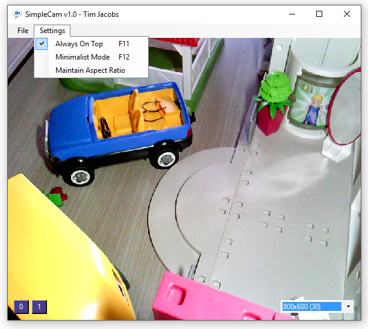

# SimpleCam
## Not another webcam software...
Due to a need of regularly giving presentations involving a webcam (I use the [Ipevo P2V - Point-To-View](http://www.ipevo.com/prods/Point-2-View-USB-Camera) for demo's of hardware & devices), I was on the lookout for a simple WebCam viewer that I can use to:
 * Show live video from any WebCam connected to my system
 * Have absolutely no UI visible at all, except for the video stream itself
 * Have the option to select the input resolution
 * An option to keep the application on top at all times (PowerPoint can run behind the webcam app).

The best match for my needs is the excellent [WebCam Viewer](http://www.bustatech.com/webcamviewer/) of Bustatech, and the latest betas should do on paper perfectly what I need, except that it's not possible to select the input resolution. It's a bit a shame to be presenting on 1080p screens with only a 640x480 VGA live stream coming in :).

SimpleCam is the result of one day of work after not immediately finding the software I need. I basically started from [the demo application of DashingQuill](https://dashingquill.wordpress.com/2012/06/27/capturing-webcam-using-directshow-net-library) and pimped it with elements of the sample code of [the DirectX.Capture library](http://www.codeproject.com/Articles/3566/DirectX-Capture-Class-Library) to get more or less what works for me.

## Usage
* Start the application and select the webcam that you want to see, using the buttons on the left bottom side of the screen; "0" is the first detected webcam, and other webcams (if any) are shown as buttons labeled "1", "2", etc... 
* Resize and position the window such that your videostream is shown as you want it.
* Enable the "AlwaysOnTop" mode (F11) and then "Minimalistic Mode" (F12) to get just the video stream shown on screen, all the time.

## Features
Currently implemented and working:
 * Enumerates all DirectShow compatible webcams detected on the system - should be pretty much all of them.
 * Easy switching between webcams from the UI
 * AlwaysOnTop mode
 * Minimalistic mode - show only webcam video stream
 * Maintain aspect ratio
 * Scale To Fit window - to ensure all webcam content is visible inside the application
 
Missing features that might appear one day:
 * Enumerate resolutions of each webcam. Now the resolution list & framerate is simply harcoded for the Ipevo P2V

## Screenshots

## Version History

Version | Date | Description
------------ | ------------- | -------------
1.0 | 26 May 2016 | First release
1.1 | 31 May 2016 | Added "Maintain Aspect Ratio" and "Scale to fit" functionality

## Downloads

Version 1.1
 * Win32 Executable: [ZIP](https://github.com/jacobstim/simplecam/files/290950/simplecam-1.1-win32.zip)

Version 1.0
 * Win32 Executable: [ZIP](https://github.com/jacobstim/simplecam/files/285222/simplecam-1.0-win32.zip)

## Legal & disclaimer

By using this application you agree that you won't blame me for anything that goes wrong, including, but not limited to: exploding harddisks, robot uprisings and zombie apocalypses(TM).

Icon made by [FreePik](http://www.flaticon.com/authors/freepik) from [www.flaticon.com](http://www.flaticon.com), and is licensed by [Creative Commons BY 3.0](http://creativecommons.org/licenses/by/3.0).
